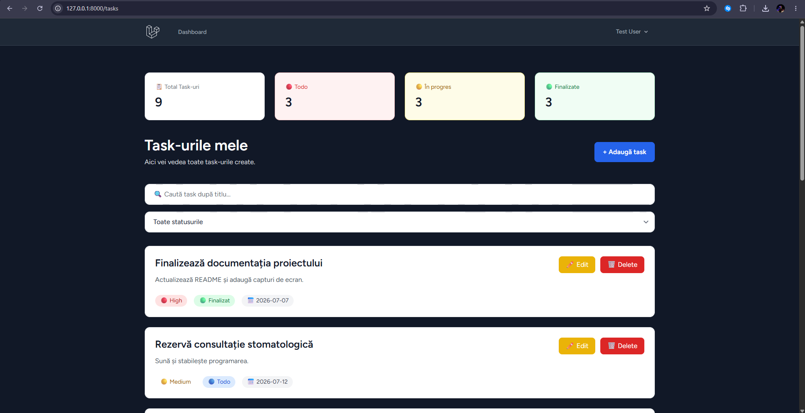
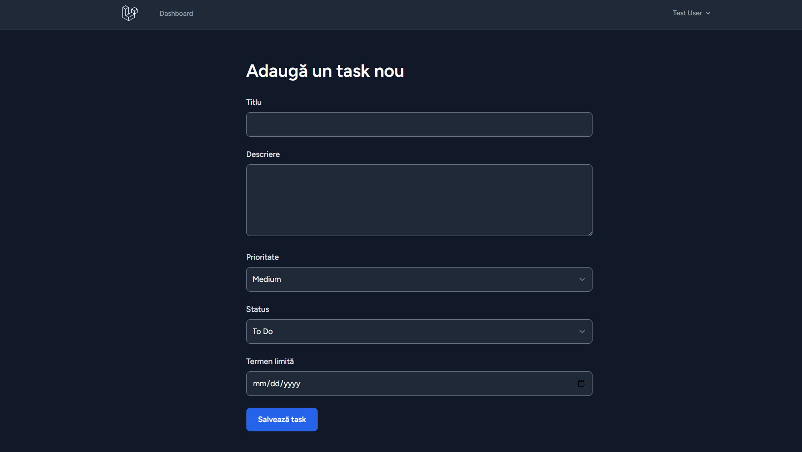
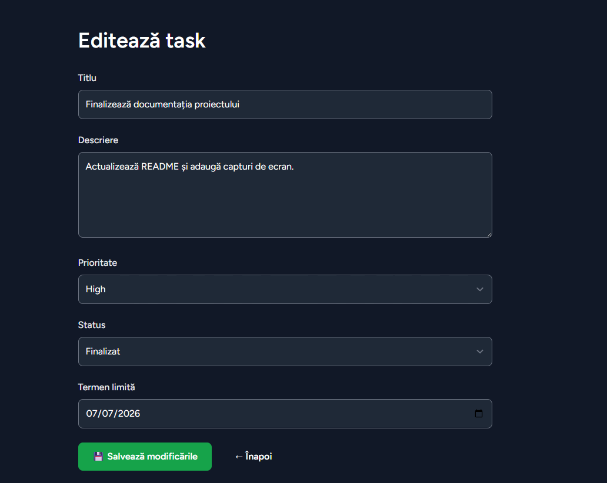
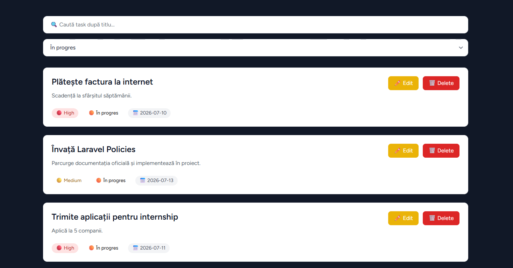
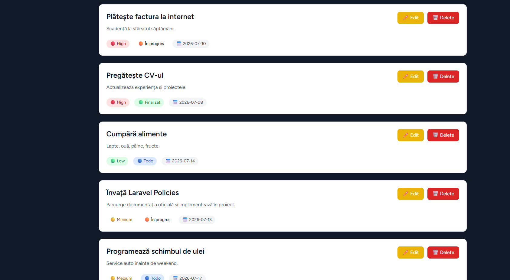

# Task Manager

Aplicație web de gestionare a task-urilor personale, construită cu Laravel 13 și PHP 8.3. Fiecare utilizator își administrează propria listă de task-uri, cu prioritizare, status, deadline-uri, căutare și filtrare.



## Funcționalități

- **Autentificare completă** (înregistrare, login, resetare parolă, verificare email) — implementată cu Laravel Breeze
- **CRUD task-uri** — creare, editare, ștergere, vizualizare
- **Prioritate** — low / medium / high
- **Status** — todo / in progress / done
- **Deadline** — dată limită opțională per task
- **Căutare** — filtrare task-uri după titlu
- **Filtrare după status**
- **Dashboard cu statistici** — total task-uri, distribuția pe status (todo / in progress / done)
- **Izolare per utilizator** — fiecare user vede și modifică doar propriile task-uri

## Capturi de ecran

<table>
<tr>
<td width="50%">

**Adăugare task**


</td>
<td width="50%">

**Editare task**


</td>
</tr>
<tr>
<td width="50%">

**Filtrare după status**


</td>
<td width="50%">

**Lista de task-uri**


</td>
</tr>
</table>

## Stack tehnic

| Componentă | Tehnologie |
|---|---|
| Backend | Laravel 13, PHP 8.3 |
| Autentificare | Laravel Breeze |
| Frontend | Blade, Tailwind CSS |
| Bază de date | MySQL |
| Testing | Pest |

## Structură bază de date

**tasks**
- `title`, `description`
- `priority` (enum: low, medium, high)
- `status` (enum: todo, in_progress, done)
- `due_date`
- `user_id` (foreign key, cascade on delete)

## Instalare locală

```bash
git clone https://github.com/RusanLucian/taskmanager.git
cd taskmanager
composer install
cp .env.example .env
php artisan key:generate
```

Configurează conexiunea la baza de date în `.env`, apoi:

```bash
php artisan migrate:fresh --seed
npm install
npm run build
php artisan serve
```

Aplicația va fi disponibilă la `http://localhost:8000`. Contul de test creat prin seeder:

- **Email:** `test@example.com`
- **Parolă:** `password`

## Roadmap

- [ ] Extragerea autorizării în `TaskPolicy` (în locul verificărilor manuale din controller)
- [ ] Validare prin `FormRequest`-uri dedicate (`StoreTaskRequest`, `UpdateTaskRequest`)
- [ ] Testare automată cu Pest
- [ ] Sortare task-uri (după deadline, prioritate)

## Autor

Rusan Lucian — proiect de portofoliu, dezvoltat ca parte a pregătirii pentru poziții de dezvoltator web.
